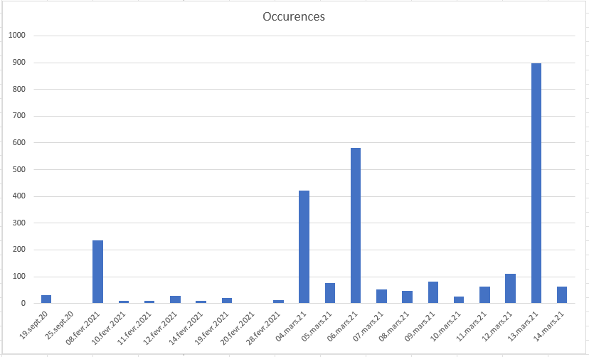

# ADS Lab 03 - Pipeline

Authors: Vincent Peer, Pablo Urizar

Date: March 19, 2023

## Task 1: Exercises on redirection

### 1. Run the following commands and tell where stdout and stderr are redirected to.  
> a. ./out > file  
```
stdout is redirected to the file. stderr still points to the command prompt.  
```
> b. ./out 2> file   
```
stdout still points to the command prompt. stderr is redirected to the file. 
```  
> c. ./out > file 2>&1   
 ```
stdout is redirected to the file. stderr is redirected to stdout, thus to the file, so both to the file.  
```
> d. ./out 2>&1 > file  
 ```
First, stderr is redirected to stdout, thus to the command prompt. Then stdout is redirected to the file but stderr is still pointing to the command prompt.  
```
> e. ./out &> file  
 ```
stdout and stderr are both redirected to the file.   
```

### 2. What do the following commands do?
> a. cat /usr/share/doc/nano/README | grep -i edit

It will display the lines that contain the word "edit" in the provided README file. The -i option ignore case distinctions in patterns and input data. So each 'edit' word will match, whether there are lowercase or uppuercase dosen't impact the result. 

> b. ./out 2>&1 | grep –i eeeee

stderr will be redirected to stdout so both will be displayed in the command prompt. Then we search for a line containing the sequence 'eeeee' with or without any 'E' due to the -i.Nothing is found so there is no result.

> c. ./out 2>&1 >/dev/null | grep –i eeeee

stderr will be redirected to stdout so to the command prompt output. Then, stdout is redirected to the file /dev/null. Each 'E' without any 'O' are printed on command prompt and each 'O' printed in the null file. As the grep functions searches for matches in the command promt, the 'EEEEE' is a match and print as result.

### 3. Write commands to perform the following tasks:
> a. Produce a recursive listing, using ls , of files and directories in your
home directory, including hidden files, in the file /tmp/homefileslist .
```bash
ls -Rla ~ > /tmp/homefileslist

ls -R -a /home > /tmp/homedocumentslist
```
> b. Produce a (non-recursive) listing of all files in your home directory whose names end in .txt , .md or .pdf , in the file /tmp/homedocumentslist . The command must not display an error message if there are no corresponding files.
```bash
ls -a /home | egrep '(.txt$)|(.md$)|(.pdf$)' > /tmp/homedocumentslist
```

## Task 2: Log analysis

1. How many log entries are in the file?
```bash  
$ wc -l ads_website.log
2781 ads_website.log
wc -l counts the number of line. We could cut the name of the file by adding | cut -c -4
```

2. How many accesses were successful (server sends back a status of 200) and how
many had an error of "Not Found" (status 404)?  
```bash
$ cut -f 10 ads_website.log | grep 200 | wc -l
1610

$ cut -f 10 ads_website.log | grep 404 | wc -l
21

Takes the 10th field, search for lines that contain 200/404 and count them.
```


3. What are the URIs that generated a "Not Found" response? Be careful in
specifying the correct search criteria: avoid selecting lines that happen to
have the character sequence 404 in the URI.  
```bash
$ cut -f 9-10 ads_website.log | grep '404$' | sort | uniq | cut -d ' ' -f 2
/heigvd-ads?cors
/heigvd-ads?lifecycle
/heigvd-ads?policy
/heigvd-ads?website  

Takes the 9th and 10th fields, keeps lines ending with 404
Sort and make them unique
Cut elements with a space delimiter in different fields and print only the 2nd field which is the one with the URI
```

4. How many different days are there in the log file on which requests were made?  
```bash   
$ cut -f 3 ads_website.log | cut -d ':' -f 1 | sort | uniq | wc -l  
21  

Takes the 3rd field with the date (ex : [19/Sep/2020:16:30:00 +0000])
Separates it with ':' delimiter
takes the first field with dd/mm/yyyy
Sort and make them unique
Counts the number of lines
```

5. How many accesses were there on 4th March 2021?  
```bash
$ cut -f3  ads_website.log | grep '04/Mar/2021' | wc -l   
423

Takes the field with the date, search lines with '04/Mar/2021' and counts them
```
6. Which are the three days with the most accesses? Hint: Create first a pipeline
that produces a list of dates preceded by the count of log entries on that
date.
```bash
$ cut -f3 ads_website.log | cut -d ':' -f1  | uniq -c | sort -r | head -n 3 | cut -c 10- 
13/Mar/2021
06/Mar/2021
04/Mar/2021

Takes the field with the date, cut it to keep only the dd/mm/yyyy part.
As logs are saved with chronological order date, we can make a uniq to get each day where a log has been saved. We use uniq -c to add a prefix number to write the number of line it appeared. 
Then we make a recursive sort, this will put on first line the line with the highest number of occurrences. We keep the first three and cut the beginning of lines to keep only the date.
```

7. Which is the user agent string with the most accesses?
```bash
$ cut -f 17 ads_website.log | sort | uniq -c | sort -r | head -n 1
423 "Mozilla/5.0 (Windows NT 6.3; WOW64; rv:27.0) Gecko/20100101 Firefox/27.0"

Takes the field with user agent string, sort each line, make them uniq and counting number of occurences. Then we sort recursively to get on the first line the highest line occurences. We print the first line.
```
8. If a web site is very popular and accessed by many people the user agent
strings appearing in the server's log can be used to estimate the relative
market share of the users' computers and operating systems. How many accesses
were done from browsers that declare that they are running on Windows, Linux
and Mac OS X (use three commands)?
```bash
Mac OS X :
$ cut -f 17 ads_website.log | grep 'Mac OS X' | wc -l
693

Windows :
$ cut -f17 ads_website.log | grep "Windows" | wc -l
1751

Linux :
$ cut -f17 ads_website.log | grep "Linux" | wc -l
180

Takes field 17
Search for 'Mac OS X' / 'Windows' / Linux inside each line
Count the number of lines in the result
```
9. Read the documentation for the tee command. Repeat the analysis of the
previous question for browsers running on Windows and insert tee into the
pipeline such that the user agent strings (including repeats) are written to a
file for further analysis (the filename should be useragents.txt ).
```bash
$ cut -f17 ads_website.log | grep "Windows" | tee useragents.txt

Takes field 17
Search lines containing 'Window'
Print the result on standard output and in the file useragents.txt
```


## Task 3: Conversion to CSV
> Extract all dates from the log file

```bash
grep -oE '\[[0-9]{2}/[A-Za-z]{3}/[0-9]{4}' ads_website.log | cut -c 2-12 > dates.txt
```

The flag "o" will only print the matched (non-empty) parts of a matching line. The flag "E" is needed for our extended regular expression to keep only the dates.

In our case, dates are sorted with a chronological order, if it wasn't the case, we could sort these dates with de following command:
> Sort dates first by year, then by month, and finally by day

```bash
sort -t'/' -k3 -k2M -k1 dates.txt > dates_tries.txt
```

The "t" flag is needed because the separator that we use for the dates is "/". The "m" flag is used to sort by month.

> Count the occurrences of each date and save them to an access.csv file

```bash
cat dates_tries.txt | uniq -c | awk '{print $2","$1}' | sed '1 i\Dates,Occurences' > access.csv
```

The command "awk" is used to concatenate the result of our previous commands separated by a comma. The command "uniq" with the "c" flag, prefix lines by the number of occurrences. That means that "$1" corresponds to the number of occurrences and "$2" corresponds to the date. The sed command is used to add a header as title on 1st line for the information about the csv data. In our CSV file we decided to first have the date and next to each date have its number of occurrences.  

First lines of the result:  
Dates,Occurences  
19/Sep/2020,31  
25/Sep/2020,2  
08/Feb/2021,236  
10/Feb/2021,9  
...  

Plot of the result:  
