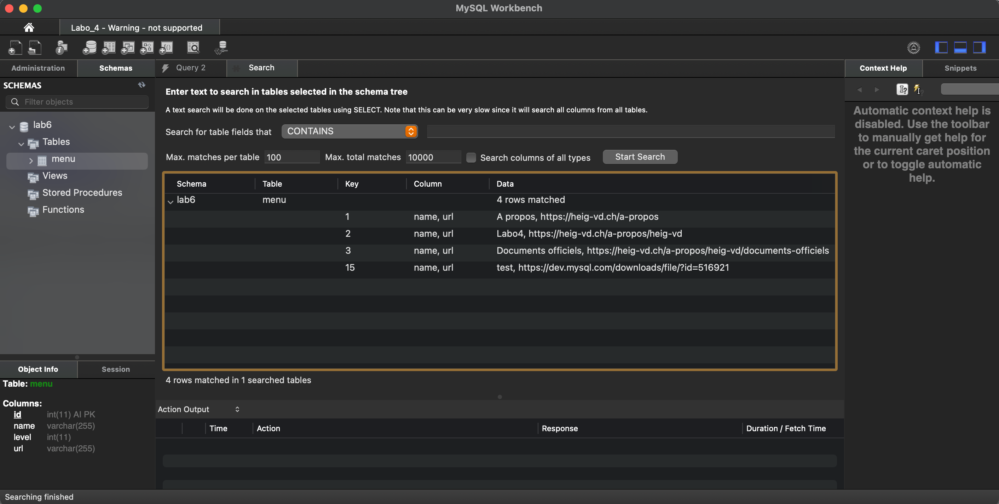

# ADS Lab 04 - Scripting
### Authors: Pablo Urizar and Vincent Peer  
### Date: April 09, 2023  

---  


## Task 2: Create thumbnails  

### Show dimensions script
>Write a script called show_dimensions that loops through all the picture files
and shows for each its name and its dimensions. For the loop use the for .. in
.. do .. done control structure.  

```  
#!/bin/bash
#
# Description : Prints the name of each picture in the lab04_raw_files directory followed by its dimensions. Picture extension should be .png or .jpg. Dimensions are width and height.
#
# Authors : Pablo Urizar, Vincent Peer
#
# Date : 09.04.2023


cd lab04_raw_files

for file in *.png *.jpg
do
        echo -e $(identify -format '%f width: %w, height: %h' $file)
done
```  


### Rename pictures script
>Write a script called rename_pictures that produces picture files that have
the dimensions in their name. For example if a picture is called building.jpg
and has a width of 1024 and a height of 768 pixels the script should create a
file building_1024_768.jpg . The script should not modify the original files,
but create new ones.

```
#!/bin/bash
#
# Description : Renames each picture with png or jpg extention. The resulting name is the  name followed by the width and the height of this picture and these new files are placed in a
 new directory named renamed_pictures.
#
# Authors : Pablo Urizar, Vincent Peer
#
# Date : 09.04.2023

cd lab04_raw_files

# Removes the directory and creates a new one
rm -rf renamed_pictures
mkdir renamed_pictures

# Add dimensions in the picture's name
for picture in *.png *.jpg
do
        picture_ext=${picture##*.}
        name=${picture%%[.]*}
        dimension=$(identify -format '%w_%h' $picture)
        filename=${name}_${dimension}.${picture_ext}

        echo "new name : $filename"
        cp $picture renamed_pictures/${filename}
done
```  
To prevent any accumulation in the name when running several time this script, it 
 will remove the renamed_pictures directory, rename each picture and save it in the new renamed_pictures directory placed in lab04_raw_files. 

### Make thumbnails script
```
#!/bin/bash
#
# Description : Converts png and jpg pictures into thumbnails. Converts a pdf file into png picture with the first page of the file.
#               
#Authors : Pablo Urizar, Vincent Peer
#
# Date : 09.04.2023


path=lab04_raw_files
cd $path

for file in *.png *.jpg *.pdf
do
        ext=${file##*.}
        name=${file%%.*}

        if [ "${name##*_}" = "thumb" ]
        then
                echo "$name is already a thumbnail"
        elif [ "$ext" = "pdf" ]
        then
                convert -geometry 300 ${file}[0] ${name}_thumb.png
        else
                convert -geometry 300 $file ${name}_thumb.${ext}
        fi
done
```


## Task 3: Generate HTML file
```
#!/bin/bash

path=raw_files
html_page_rel_path=../page.html


cat /home/lab5/public_html/lab04_template/template_begin.html > page.html


cd $path

for file in *.png *.jpg
do
        ext=${file##*.}
        name=${file%%.*}

        echo "<div class=\"col-md-6 col-xs-12\">" \
                "<a href=\"${path}/${file}\"></a>" \
                "</div>" >> ${html_page_rel_path}
done


echo "</div></div>" >> ${html_page_rel_path}
echo "<div class=\"row\" style=\"margin-top: 40px;\">" \
        "<div class=\"col-md-10 col-md-pull-3 col-md-offset-4 article__content\">" \
        "<div>" \
        "<div><h2>Téléchargez nos brochures</h2></div>" \
        "</div>" \
        "<div class=\"row\">" >> ${html_page_rel_path}

for file in *.pdf
do
        name=${file%%.*}

        echo "<div class=\"col-md-6 col-xs-12\">" \
                "<a href=\"${path}/${file}\">" \
                "" \
                "</a>" \
                "</div>" >> ${html_page_rel_path}
done


echo "</div></div></div>" >> ${html_page_rel_path}

cat ../lab04_template/template_end.html >> ${html_page_rel_path}
```

## Task 4: Use SSH Tunneling

SSH command :  
> ssh ads.iict.ch -L 5454:localhost:3306
-L allows to bind port from remote to local.  
